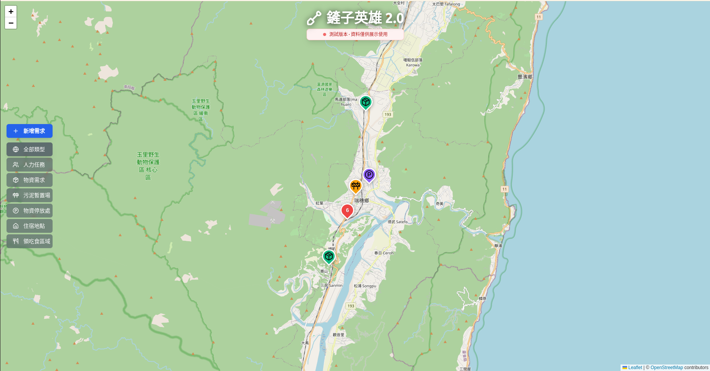

# 鏟子英雄 2.0

救援對接媒合平台 - 提供災區人力需求、物資需求、場站資訊等之集中發布與媒合。



## 🚀 快速開始

### 前置需求

- Bun v1.0 或以上
- Node.js v18 或以上（作為備選）

### 安裝

```bash
# 安裝依賴
bun install
```

### 開發

```bash
# 啟動開發伺服器
bun run dev
```

開發伺服器將在 http://localhost:5173 啟動

### 建置

```bash
# 建置生產版本
bun run build

# 預覽生產版本
bun run preview
```

## 🔧 環境變數設定

1. 複製 `.env.example` 為 `.env`
2. 在 Firebase Console 建立專案
3. 取得 Firebase 配置並填入 `.env` 檔案

```bash
cp .env.example .env
```

## 📁 專案結構

```
shovel-heroes/
├── src/
│   ├── assets/          # 靜態資源與全域樣式
│   ├── components/      # Vue 組件
│   │   └── Map/        # 地圖相關組件
│   ├── config/         # 配置檔案（Firebase 等）
│   ├── lib/            # 工具函數
│   ├── router/         # Vue Router 設定
│   ├── stores/         # Pinia 狀態管理
│   ├── views/          # 頁面組件
│   ├── App.vue         # 根組件
│   └── main.js         # 應用入口
├── public/             # 公開靜態資源
├── plan.md            # 專案需求文件
└── README.md          # 專案說明
```

## 🛠 技術堆疊

- **前端框架**: Vue 3 + Vite
- **狀態管理**: Pinia
- **路由**: Vue Router 4
- **樣式**: Tailwind CSS
- **組件庫**: Radix Vue (shadcn-vue)
- **圖標**: Lucide Vue Next
- **地圖**: Leaflet + OpenStreetMap
- **後端**: Firebase (Firestore, Auth, Functions)
- **部署**: Firebase Hosting

## 📋 主要功能

### 已實作

- ✅ 基礎專案架構設置
- ✅ Tailwind CSS 與樣式系統
- ✅ Vue Router 路由設定
- ✅ Pinia 狀態管理
- ✅ Firebase 配置
- ✅ 地圖視圖組件（Leaflet）
- ✅ 詳情面板（分欄式布局）
- ✅ 篩選功能

### 待實作

- ⏳ Firebase Auth 整合（Google 登入）
- ⏳ Firestore 資料讀寫
- ⏳ 志工報名表單
- ⏳ 物資捐贈表單
- ⏳ 管理員審核系統
- ⏳ 自動審核機制
- ⏳ Email 通知系統
- ⏳ 討論區功能
- ⏳ 資料匯出功能

## 🗺️ 地圖功能

- 全螢幕互動式地圖（Leaflet + OSM）
- 支援不同類型的需求標記：
  - 🔵 人力任務
  - 🟢 物資需求
  - 🟠 污泥暫置場
  - 🟣 物資停放處
  - 🩷 住宿地點
  - 🟧 領吃食區域
- 點擊標記開啟詳情面板
- 地圖區域自動調整以容納面板
- 支援篩選與搜尋

## 📱 響應式設計

- 手機優先設計
- 桌面端：分欄式布局（地圖 + 側邊面板）
- 行動端：全螢幕切換模式

## 🔐 權限系統

- **訪客/志工/捐贈者**：可瀏覽地圖、提交報名/捐贈表單（免登入）
- **管理員**：需登入（Google Auth），可審核、編輯、管理所有內容

## 📝 開發指南

### 新增組件

建議使用 shadcn-vue 的設計風格來保持一致性。所有組件都應該支援 Tailwind CSS 的樣式定制。

### 狀態管理

使用 Pinia stores 來管理全域狀態：

- `useMapStore` - 地圖相關狀態
- `useAuthStore` - 認證相關狀態

### Firebase 整合

參考 `src/config/firebase.js` 來使用 Firebase 服務。

## 📄 授權

MIT License

## 👥 貢獻

歡迎提交 Pull Request 或開啟 Issue 來協助改善專案。

---

建置時間：2025-10
